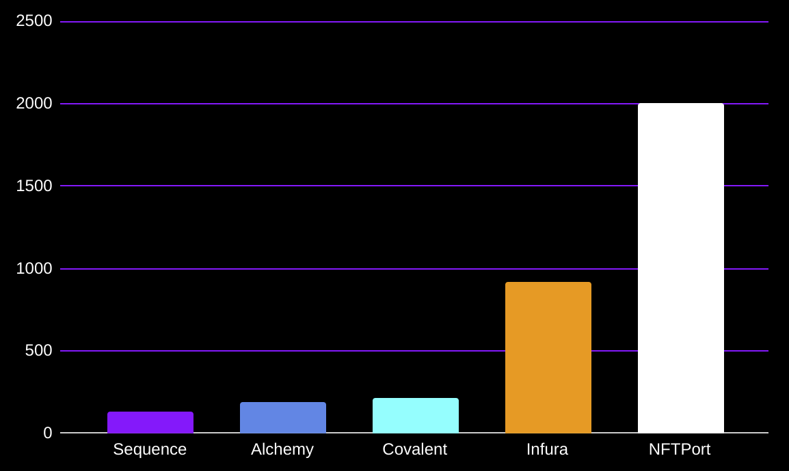
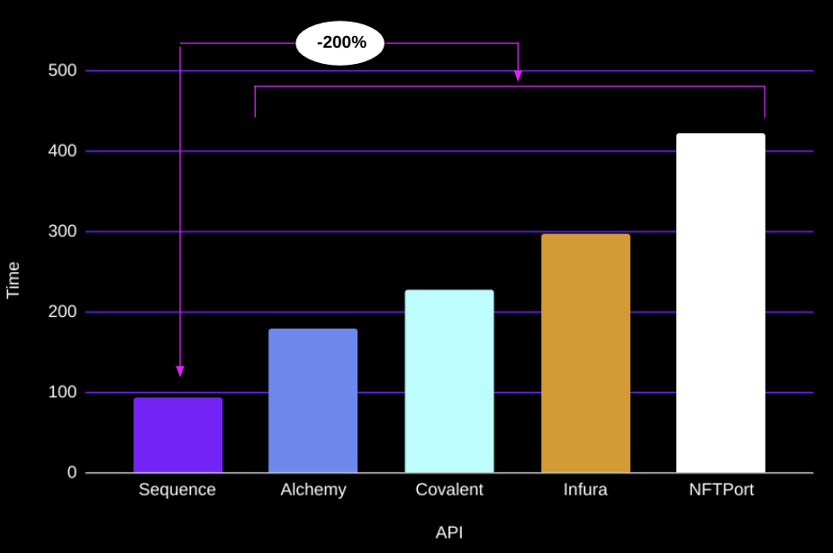
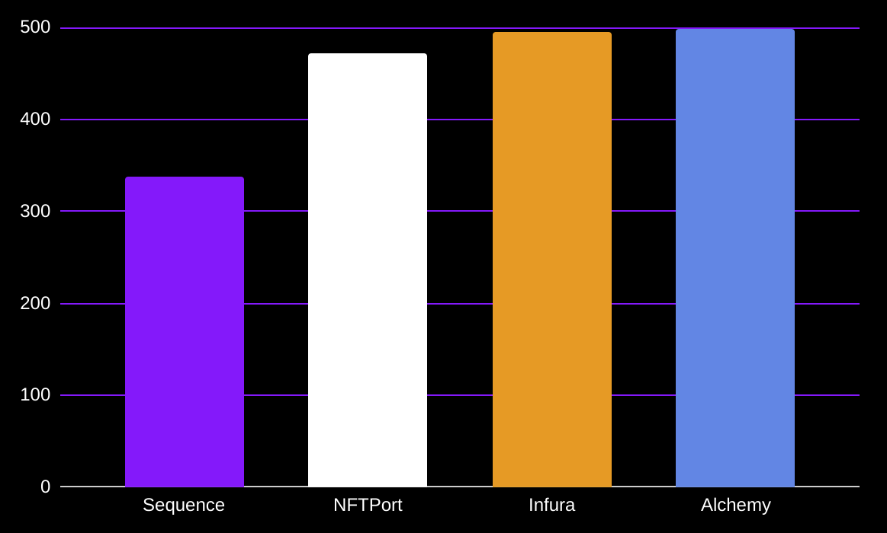

# web3-infrastructure-benchmark


## methodology

### token balance
- 10 different wallet addresses
- 10 requests per wallet address
- >=1 second between requests

Result
```
Token Balance
┌──────────────────────────────┬──────────────────────────────┐
│ API                          │ Time (ms)                    │
├──────────────────────────────┼──────────────────────────────┤
│ Sequence Indexer             │ 132.62                       │
├──────────────────────────────┼──────────────────────────────┤
│ Infura API                   │ 916.79                       │
├──────────────────────────────┼──────────────────────────────┤
│ Covalent Balances            │ 216.03                       │
├──────────────────────────────┼──────────────────────────────┤
│ Alchemy                      │ 189.56                       │
├──────────────────────────────┼──────────────────────────────┤
│ NFTPort                      │ 2006.46                      │
└──────────────────────────────┴──────────────────────────────┘
```

## token balance benchmark


### NFT metadata
TBC

```
NFT Metadata (one shot requests)
┌──────────────────────────────┬──────────────────────────────┐
│ API                          │ Time (ms)                    │
├──────────────────────────────┼──────────────────────────────┤
│ Sequence Indexer Metadata    │ 94                           │
├──────────────────────────────┼──────────────────────────────┤
│ Infura NFT API               │ 298                          │
├──────────────────────────────┼──────────────────────────────┤
│ Covalent                     │ 228                          │
├──────────────────────────────┼──────────────────────────────┤
│ Alchemy                      │ 179                          │
├──────────────────────────────┼──────────────────────────────┤
│ NFTPort                      │ 422                          │
└──────────────────────────────┴──────────────────────────────┘
```

## metadata benchmark


### ERC1155 token balance update benchmark

┌──────────────────────────────┬──────────────────────────────┬──────────────────────────────┐
│ API                          │ Time with Relayer (ms)       │ Time without Relayer (ms)    │
├──────────────────────────────┼──────────────────────────────┼──────────────────────────────┤
│ Sequence Indexer             │ 6608                         │ 338                          │
├──────────────────────────────┼──────────────────────────────┼──────────────────────────────┤
│ NFTPort                      │ 6742                         │ 472                          │
├──────────────────────────────┼──────────────────────────────┼──────────────────────────────┤
│ Infura API                   │ 6765                         │ 495                          │
├──────────────────────────────┼──────────────────────────────┼──────────────────────────────┤
│ Alchemy                      │ 6769                         │ 499                          │
└──────────────────────────────┴──────────────────────────────┴──────────────────────────────┘


