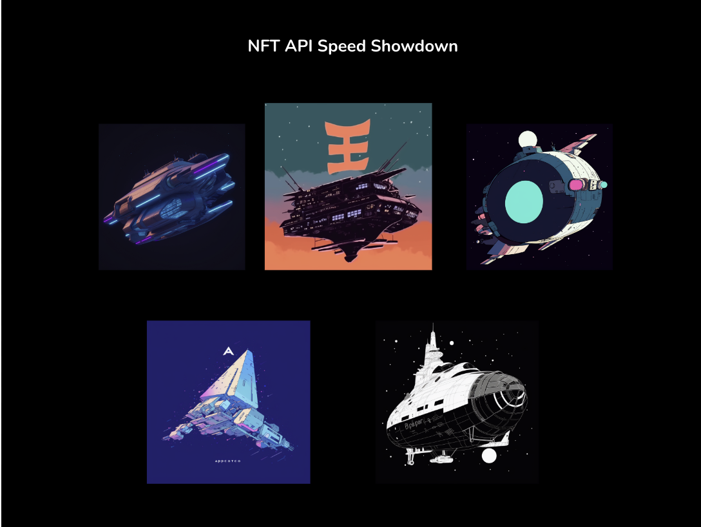
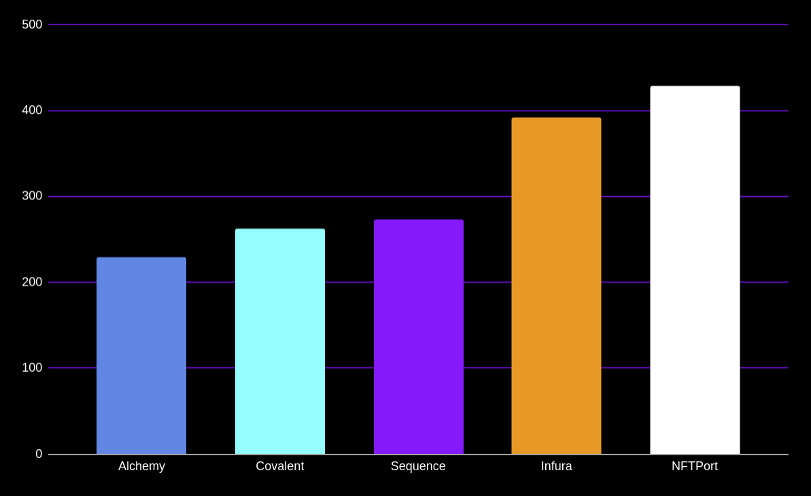

# web3-infrastructure-benchmark



```
Token Balance
┌──────────────────────────────┬──────────────────────────────┐
│ API                          │ Time (ms)                    │
├──────────────────────────────┼──────────────────────────────┤
│ Sequence Indexer             │ 242                          │
├──────────────────────────────┼──────────────────────────────┤
│ Infura API                   │ 297                          │
├──────────────────────────────┼──────────────────────────────┤
│ Covalent Balances            │ 237                          │
├──────────────────────────────┼──────────────────────────────┤
│ Alchemy                      │ 180                          │
├──────────────────────────────┼──────────────────────────────┤
│ NFTPort                      │ 488                          │
└──────────────────────────────┴──────────────────────────────┘

NFT Metadata
┌──────────────────────────────┬──────────────────────────────┐
│ API                          │ Time (ms)                    │
├──────────────────────────────┼──────────────────────────────┤
│ Sequence Indexer Metadata    │ 94                           │
├──────────────────────────────┼──────────────────────────────┤
│ Infura NFT API               │ 298                          │
├──────────────────────────────┼──────────────────────────────┤
│ Covalent                     │ 228                          │
├──────────────────────────────┼──────────────────────────────┤
│ Alchemy                      │ 179                          │
├──────────────────────────────┼──────────────────────────────┤
│ NFTPort                      │ 422                          │
└──────────────────────────────┴──────────────────────────────┘
```

