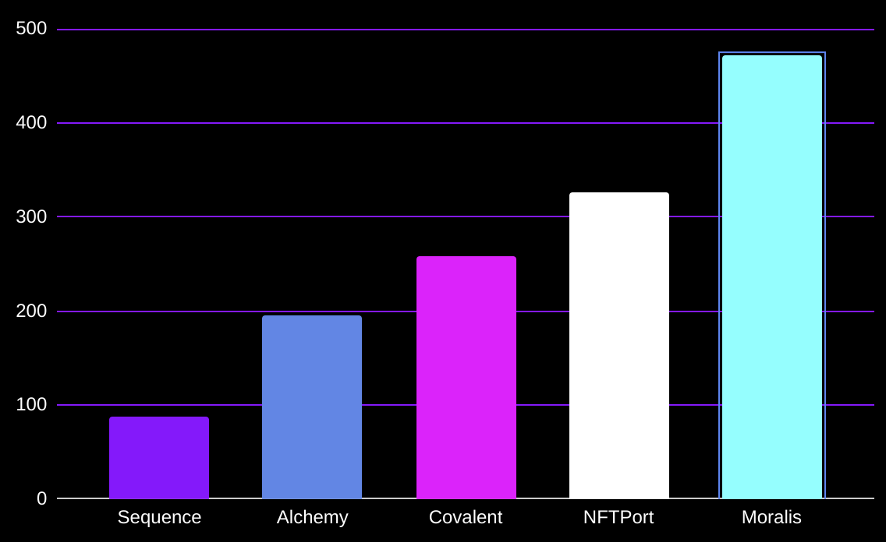

# web3-infrastructure-benchmark


## methodology

### 1. Token Balance
- 10 different wallet addresses
- 10 requests per wallet address
- ~1 second between requests
- 100 trialed average across apis

### 2. NFT metadata
- 10 different smart contract address
- 10 requests per smart contract
- ~1 second between requests
- 100 trialed average across apis

### 3. ERC1155 Token Balance "time to update"
- average over 30 state changes with the sequence relayer

# 1. Token Balance
```
┌──────────────────────────────┬──────────────────────────────┐
│ API                          │ Time (ms)                    │
├──────────────────────────────┼──────────────────────────────┤
│ Sequence Indexer             │ 132.62                       │
├──────────────────────────────┼──────────────────────────────┤
│ Infura API                   │ 916.79                       │
├──────────────────────────────┼──────────────────────────────┤
│ Covalent Balances            │ 216.03                       │
├──────────────────────────────┼──────────────────────────────┤
│ Alchemy                      │ 189.56                       │
├──────────────────────────────┼──────────────────────────────┤
│ NFTPort                      │ 2006.46                      │
└──────────────────────────────┴──────────────────────────────┘
```

## Graph Comparison: Token Balance Benchmark (ms)


# 2. NFT metadata (one shot requests)
TBC
```
┌──────────────────────────────┬──────────────────────────────┐
│ API                          │ Time (ms)                    │
├──────────────────────────────┼──────────────────────────────┤
│ Sequence Indexer Metadata    │ 94                           │
├──────────────────────────────┼──────────────────────────────┤
│ Infura NFT API               │ 298                          │
├──────────────────────────────┼──────────────────────────────┤
│ Covalent                     │ 228                          │
├──────────────────────────────┼──────────────────────────────┤
│ Alchemy                      │ 179                          │
├──────────────────────────────┼──────────────────────────────┤
│ NFTPort                      │ 422                          │
└──────────────────────────────┴──────────────────────────────┘
```

## Graph Comparison: NFT Metadata Benchmark (ms)


# 3. ERC1155 Token Balance Time to Update (ms)
```
┌──────────────────────────────┬──────────────────────────────┐
│ API                          │ Time without Relayer (ms)    │
├──────────────────────────────┼──────────────────────────────┤
│ Sequence Indexer             │ 467.3                        │
├──────────────────────────────┼──────────────────────────────┤
│ NFTPort                      │ 26376                        │
├──────────────────────────────┼──────────────────────────────┤
│ Infura API                   │ 44382.6                      │
├──────────────────────────────┼──────────────────────────────┤
│ Alchemy                      │ 705.7                        │
└──────────────────────────────┴──────────────────────────────┘

```
## Graph Comparison: "Time to Update" Benchmark


# 4. Wallet Transaction History (ms)
```
┌──────────────────────────────┬──────────────────────────────┐
│ API                          │ Time (ms)                    │
├──────────────────────────────┼──────────────────────────────┤
│ Sequence Indexer             │ 86.7                         │
├──────────────────────────────┼──────────────────────────────┤
| Infura                       | N/A                          |
├──────────────────────────────┼──────────────────────────────┤
│ Covalent                     │ 456.93                       │
├──────────────────────────────┼──────────────────────────────┤
│ Alchemy                      │ 253.3                        │
├──────────────────────────────┼──────────────────────────────┤
│ NFTPort                      │ 365.7                        │
├──────────────────────────────┼──────────────────────────────┤
│ Moralis                      │ 109.65                       │
└──────────────────────────────┴──────────────────────────────┘
```

## Graph Comparison: Wallet Transaction History Benchmark


# 5. Contract Transaction History (ms)
```
┌──────────────────────────────┬──────────────────────────────┐
│ API                          │ Time (ms)                    │
├──────────────────────────────┼──────────────────────────────┤
│ Sequence Indexer             │ 87.5                         │
├──────────────────────────────┼──────────────────────────────┤
│ Covalent                     │ 258.35                       │
├──────────────────────────────┼──────────────────────────────┤
│ Alchemy                      │ 195.6                        │
├──────────────────────────────┼──────────────────────────────┤
│ NFTPort                      │ 325.9                        │
├──────────────────────────────┼──────────────────────────────┤
│ Moralis                      │ 471.89                       │
└──────────────────────────────┴──────────────────────────────┘
```

## Graph Comparison: Contract Transaction History Benchmark

